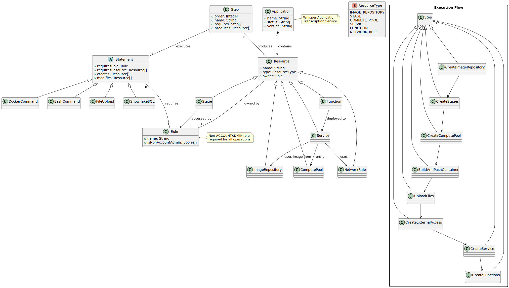

# OpenAI's Whisper in Snowpark Container Services
This repository explains how to run OpenAI's [Whisper](https://github.com/openai/whisper) in Snowpark Container Services.  
Afterwards you can easily transcribe any audio file into text and detect its language.

## Requirements
* Account with Snowpark Container Services
* Docker installed
* Use a role <u>other than ACCOUNTADMIN</u> as described here: [Docs](https://docs.snowflake.com/en/developer-guide/snowpark-container-services/additional-considerations-services-jobs#network-egress)

## Setup Instructions
### 1. Get your Snowflake account GUID
You can obtain your account GUID by running:
```sql
SELECT CURRENT_ACCOUNT() as ACCOUNT_NAME, 
       SYSTEM$GET_SNOWFLAKE_PLATFORM_INFO()['platformInfo']['accountGuid'] as ACCOUNT_GUID;
```

### 2. Create image repository, stages and compute pool 
```sql
-- create image repository
CREATE OR REPLACE IMAGE REPOSITORY ${DATABASE}.${SCHEMA}.TEST_IMAGE_REPOSITORY;

-- Create Stages
CREATE STAGE IF NOT EXISTS ${MODELS_STAGE_NAME} ENCRYPTION = (TYPE = 'SNOWFLAKE_SSE') DIRECTORY = (ENABLE = TRUE);
CREATE STAGE IF NOT EXISTS ${AUDIO_STAGE_NAME} ENCRYPTION = (TYPE = 'SNOWFLAKE_SSE') DIRECTORY = (ENABLE = TRUE);

-- Create Compute Pool
CREATE COMPUTE POOL ${COMPUTE_POOL_NAME}
  MIN_NODES = ${MIN_NODES}
  MAX_NODES = ${MAX_NODES}
  INSTANCE_FAMILY = ${INSTANCE_FAMILY};
```

### 3. Clone this repository
```bash
git clone https://github.com/michaelgorkow/scs_whisper.git
```

### 4. Build & Upload the container
```cmd
cd scs_whisper
docker build --platform linux/amd64 -t ${docker.registry}/${docker.repository}/${docker.image}:${docker.tag} .
docker push ${docker.registry}/${docker.repository}/${docker.image}:${docker.tag}
```

### 5. Upload files to stages  
Use your favourite way of uploading files and upload 
* the `spec.yml` to stage `WHISPER_APP`
* the audio files to stage `AUDIO_FILES`

### 6. Create External Access Integration
```sql
-- Create External Access Integration
CREATE OR REPLACE NETWORK RULE ${NETWORK_RULE_NAME}
    MODE = EGRESS
    TYPE = HOST_PORT
    VALUE_LIST = ('0.0.0.0:443','0.0.0.0:80');

CREATE OR REPLACE EXTERNAL ACCESS INTEGRATION ${INTEGRATION_NAME}
    ALLOWED_NETWORK_RULES = (${NETWORK_RULE_NAME})
    ENABLED = true;
```

### 7. Create the Whisper Service
```sql
-- Create Service
CREATE SERVICE ${SERVICE_NAME}
  IN COMPUTE POOL ${COMPUTE_POOL_NAME}
  FROM @${APP_STAGE_NAME}
  SPEC='spec.yml'
  MIN_INSTANCES=${SERVICE_MIN_INSTANCES}
  MAX_INSTANCES=${SERVICE_MAX_INSTANCES}
  EXTERNAL_ACCESS_INTEGRATIONS = (${INTEGRATION_NAME});

-- Verify Service is running
SELECT SYSTEM$GET_SERVICE_STATUS('${SERVICE_NAME}');
```

### 8. Create the service functions for language detection and transcription
```sql
-- Function to detect language from audio file
CREATE OR REPLACE FUNCTION DETECT_LANGUAGE(AUDIO_FILE TEXT, ENCODE BOOLEAN)
RETURNS VARIANT
SERVICE=${SERVICE_NAME}
ENDPOINT=API
AS '/detect-language';

-- Function to transcribe audio files
CREATE OR REPLACE FUNCTION TRANSCRIBE(TASK TEXT, LANGUAGE TEXT, AUDIO_FILE TEXT, ENCODE BOOLEAN)
RETURNS VARIANT
SERVICE=${SERVICE_NAME}
ENDPOINT=API
AS '/asr';
```

### 9. Call the service functions using files from a Directory Table
```sql
-- Run Whisper on a files in a stage
SELECT RELATIVE_PATH, 
       GET_PRESIGNED_URL('@${DATABASE}.${SCHEMA}.${AUDIO_STAGE_NAME}', RELATIVE_PATH) AS PRESIGNED_URL,
       DETECT_LANGUAGE(PRESIGNED_URL,True)  AS WHISPER_RESULTS,
       WHISPER_RESULTS['detected_language']::text as DETECTED_LANGUAGE
FROM DIRECTORY('@${DATABASE}.${SCHEMA}.${AUDIO_STAGE_NAME}');

SELECT RELATIVE_PATH, 
       GET_PRESIGNED_URL('@${DATABASE}.${SCHEMA}.${AUDIO_STAGE_NAME}', RELATIVE_PATH) AS PRESIGNED_URL,
       TRANSCRIBE('transcribe','',PRESIGNED_URL,True) AS WHISPER_RESULTS,
       WHISPER_RESULTS['text']::TEXT as EXTRACTED_TEXT
FROM DIRECTORY('@${DATABASE}.${SCHEMA}.${AUDIO_STAGE_NAME}');
```

### 10. Clean your environment
```sql
-- Clean Up
DROP SERVICE ${SERVICE_NAME};
DROP COMPUTE POOL ${COMPUTE_POOL_NAME};
```

### Debugging: View Logs
If you want to know what's happening inside the container, you can retrieve the logs at any time.
```sql
-- See logs of container
SELECT value AS log_line
FROM TABLE(
 SPLIT_TO_TABLE(SYSTEM$GET_SERVICE_LOGS('${SERVICE_NAME}', 0, 'proxy'), '\n')
  );
```

## Demo Video
https://github.com/michaelgorkow/scs_whisper/assets/28981844/9834dc43-932e-4d53-ade2-467f25f5da6d

## Architecture
The following diagram shows the architecture and dependencies of the Whisper Application:



The diagram illustrates:
- Core components and their relationships
- Execution flow and dependencies
- Resource types and ownership
- Role-based access requirements
- Service and function deployment structure

## Tools

### `set_conda_env_var.sh`
A utility script to manage environment variables in Conda environments. This script creates activation and deactivation hooks to automatically set and unset environment variables when you activate/deactivate your Conda environment.

**Key Features:**
- Environment-scoped variables
- Automatic Git integration (if in a repository)
- Idempotent variable setting
- Safe cleanup on environment deactivation

**Usage:**
```bash
./tools/set_conda_env_var.sh <environment_name> <variable_name> <variable_value>
```

**Example - Setting up Snowflake authentication:**
```bash
# Set the private key path
./tools/set_conda_env_var.sh sccs SNOWFLAKE_PRIVATE_KEY_PATH "~/.ssh/snowflake.p8"

# Set the authenticator type
./tools/set_conda_env_var.sh sccs SNOWFLAKE_AUTHENTICATOR "SNOWFLAKE_JWT"
```

For detailed documentation, see [docs/tools/set_conda_env_var.md](docs/tools/set_conda_env_var.md).

## Environment Setup

1. Copy the environment template:
```bash
cp config/env.template .env
```

2. Edit the .env file with your specific values:
```bash
vim .env
```

3. Load the environment variables:
```bash
source .env
```


